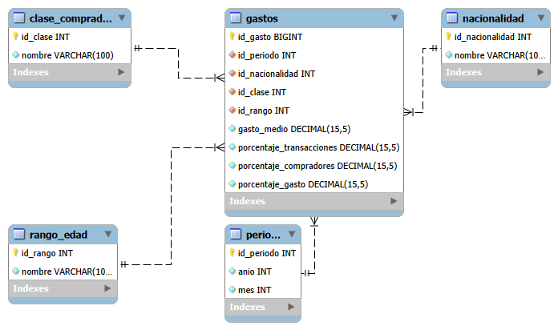

# 📊 DIVA Streamlit App – Galicia (A Coruña)

Aplicación interactiva desarrollada con **Streamlit** para consultar, procesar y analizar datos turísticos de la **API DIVA (SEGITTUR)** para Galicia – provincia de A Coruña. Incluye integración con MySQL, análisis exploratorio avanzado y visualizaciones interactivas con Plotly.

---

## 🎯 Objetivos

- ✅ Consultar la **API DIVA en tiempo real** (SEGITTUR).
- ✅ Limpiar y normalizar datos automáticamente.
- ✅ Almacenar datos en **base de datos MySQL** (modelo dimensional).
- ✅ Proporcionar **análisis exploratorio interactivo** (EDA).
- ✅ Visualizar datos con gráficos avanzados (**Plotly**, mapas **Folium**).
- ✅ Permitir filtros dinámicos por nacionalidad, rango de edad y segmento de comprador.
- ✅ Despliegue con **Docker Compose** (MySQL + Streamlit + phpMyAdmin).
- Consultar la API DIVA en tiempo real.
- Limpiar y normalizar los datos automáticamente.
- Proporcionar análisis exploratorio interactivo.
- Visualizar datos numéricos de manera sencilla.
- Permitir refrescar los datos con un botón.
- Garantizar coherencia en métricas agregadas mediante promedios (avg).
- Mostrar comparativas temporales dinámicas y métricas de recuperación fiables.

---

## 📁 Estructura del proyecto

```
tourist-data-a-coruna/
├── app.py                           # App principal Streamlit
├── requirements.txt                 # Dependencias Python
├── Dockerfile                       # Imagen Docker para Streamlit
├── docker-compose.yml               # Orquestación de servicios (MySQL, Streamlit, phpMyAdmin)
├── .dockerignore                    # Archivos a ignorar en Docker
│
├── services/
│   └── api_data.py                  # Funciones para consumir la API DIVA
│
├── processing/
│   └── cleaning.py                  # Limpieza y transformación de datos
│
├── analysis/
│   └── eda.py                       # Análisis exploratorio de datos
│
├── docs/
│   ├── TFM_BD.sql                   # Definición del modelo dimensional
│   ├── Insert.sql                   # Script de carga de datos
│   ├── Consultas.sql                # Queries útiles
│   ├── conexion_mysql.py            # Conexión a MySQL con SQLAlchemy
│   └── dataset/
│       └── diva_limpio.csv          # Dataset limpio para carga en BD
│
└── README.md                        # Este archivo
```

---

## 🚀 Instalación y uso

### Opción 1: Ejecución Local

#### Requisitos previos

- Python 3.9+
- pip
- Git

#### Pasos

1. **Clonar el repositorio:**

```bash
git clone https://github.com/LizethDayannaSC/tourist-data-a-coruna.git
cd tourist-data-a-coruna
```

2. **Crear entorno virtual:**

```bash
python -m venv venv
source venv/bin/activate      # Linux/macOS
# o
venv\Scripts\activate         # Windows
```

3. **Instalar dependencias:**

```bash
pip install -r requirements.txt
```

4. **Ejecutar la aplicación:**

```bash
streamlit run app.py
```

5. **Abrir en navegador:**

```
http://localhost:8501
```

---

### Opción 2: Docker Compose (Recomendado)

#### Requisitos previos

- Docker
- Docker Compose

#### Pasos

1. **Clonar el repositorio:**

```bash
git clone https://github.com/LizethDayannaSC/tourist-data-a-coruna.git
cd tourist-data-a-coruna
```

2. **Lanzar los servicios:**

```bash
docker-compose up --build
```

3. **Acceder a los servicios:**

| Servicio      | URL                       | Descripción                           |
|---------------|---------------------------|---------------------------------------|
| **Streamlit** | http://localhost:8502     | Dashboard principal                   |
| **phpMyAdmin**| http://localhost:8080     | Gestor de BD (usuario: `root`, pass: `12345678`) |
| **MySQL**     | localhost:3306            | Base de datos                         |

---

## 🎨 Funcionalidades de la App

### 1. **Interfaz Principal**
   - 🗺️ Mapa interactivo de A Coruña con Folium.
   - 📍 Marcadores de lugares turísticos emblemáticos.
   - 📝 Información cultural y gastronómica sobre A Coruña.

### 2. **Gestión de Datos**
   - 📥 Descarga en tiempo real desde la **API DIVA**.
   - 🧹 Limpieza automática de datos (normalización, codificación múltiple, eliminación de duplicados).
   - 📊 Vista comparativa: datos originales vs. datos limpios.

### 3. **Análisis Exploratorio (EDA)**
   - 📈 Estadísticas descriptivas avanzadas (media, mediana, desv. est., percentiles).
   - 🔍 Matriz de correlación entre variables numéricas.
   - 📦 Detecta y visualiza outliers.
   - 🎯 Explorador dinámico: filtra por métrica y agrupa por cualquier dimensión.

### 4. **Filtros Estratégicos**
   - 👥 **Segmento de edad:** Menos de 40, 40-54, Más de 54 años.
   - 🌍 **Nacionalidad:** Multiselección dinámica.
   - 📅 **Rango de fechas:** Selector temporal interactivo.
   - 🛍️ **Clase de comprador:** Filtrado por tipo de cliente.

### 5. **Indicadores Clave (KPIs)**
   - 📊 Volumen promedio de actividad transaccional.
   - 💰 Gasto medio por turista.
   - 📈 Recuperación vs. período pre-pandemia (2019).
   - 🏆 Top nacionalidad por gasto acumulado.

### 6. **Visualizaciones Interactivas**
   - 📉 **Gráficos de líneas:** Evolución del gasto por nacionalidad.
   - 🥧 **Donut chart:** Segmentación por rango de edad.
   - 📦 **Box plots:** Análisis de dispersión y outliers.
   - 🌡️ **Heatmap:** Estacionalidad (nacionalidad × mes).
   - 🌳 **Treemap:** Composición del mercado por país y edad.
   - 📊 **Scatter plots:** Relación transacciones vs. gasto.
   - 📚 **Stacked bars:** Distribución de tipo de comprador.

### 7. **Análisis Avanzados**
   - 🔗 Correlación entre variables numéricas.
   - 💎 Perfil de lealtad por nacionalidad.
   - 🎯 Análisis de valor: volumen vs. gasto.
   - 📮 Proyecciones estratégicas 2025.

---

## 🔧 Detalle de Módulos

### [services/api_data.py](services/api_data.py)

Contiene la función [`fetch_diva_data()`](services/api_data.py) que:
- Realiza peticiones GET a la API DIVA (SEGITTUR).
- Maneja múltiples encodings (UTF-8, Latin-1, ISO-8859-1, CP1252).
- Captura excepciones de timeout y errores de red.
- Retorna un DataFrame de pandas o DataFrame vacío si falla.

### [processing/cleaning.py](processing/cleaning.py)

Contiene la función [`clean_diva_data(df)`](processing/cleaning.py) que:
- Normaliza nombres de columnas (minúsculas, `_` en lugar de espacios).
- Elimina columnas completamente vacías.
- Elimina filas duplicadas.
- Convierte tipos de datos automáticamente.
- Maneja valores faltantes y outliers.

### [analysis/eda.py](analysis/eda.py)

Contiene funciones de análisis:
- [`basic_stats(df)`](analysis/eda.py): Estadísticas descriptivas detalladas.
- Resumen de valores nulos.
- Análisis de distribuciones.

### [docs/conexion_mysql.py](docs/conexion_mysql.py)

Conexión a MySQL usando **SQLAlchemy**:
- Lee variables de entorno para configuración.
- Proporciona función [`obtener_datos(limit=10)`](docs/conexion_mysql.py).
- Pool de conexiones con health check (`pool_pre_ping`).

### [docs/TFM_BD.sql](docs/TFM_BD.sql)

Define el **modelo dimensional** de la base de datos:
- **Dimensiones:** Periodo, Nacionalidad, Clase_Comprador, Rango_Edad.
- **Fact Table:** Gastos (con claves foráneas e índices).
- Constraints de integridad referencial.

### [docs/Insert.sql](docs/Insert.sql)

Script de carga:
- Crea tabla temporal (Staging).
- Carga CSV desde ruta Docker: `/var/lib/mysql-files/diva_limpio.csv`.
- Pobla dimensiones e inserta hechos.

---

## 📊 Modelo de Datos

### Esquema Dimensional (Star Schema)



---

## 🐳 Servicios Docker

### MySQL 8.0

```yaml
- Base de datos TFM
- Usuario: root
- Contraseña: 12345678
- Puerto: 3306
- Volúmenes:
  - Script de creación de BD
  - Script de carga de datos
  - Dataset CSV
```

### Streamlit

```yaml
- Aplicación web interactiva
- Puerto: 8502
- Volumen: código de la aplicación
```

### phpMyAdmin

```yaml
- Gestor gráfico de MySQL
- Puerto: 8080
- Credenciales: root / 12345678
```

---

## 📋 Dependencias Principales

```
streamlit>=1.28.0          # Framework web
pandas>=2.0.0              # Manipulación de datos
plotly>=5.17.0             # Visualizaciones interactivas
requests>=2.31.0           # Cliente HTTP para API
folium>=0.14.0             # Mapas interactivos
streamlit-folium>=0.11.0   # Integración Folium + Streamlit
sqlalchemy>=2.0.0          # ORM y conexión BBDD
pymysql>=1.1.0             # Driver MySQL
numpy>=1.24.0              # Computación numérica
```

Ver [requirements.txt](requirements.txt) para versiones exactas.

---

## 🎯 Casos de Uso

1. **Análisis de tendencias turísticas:** Identifica patrones de gasto por nacionalidad y época.
2. **Segmentación de clientes:** Analiza comportamiento por edad y tipo de comprador.
3. **Proyección de ingresos:** Estima crecimiento para 2025 basado en datos históricos.
4. **Optimización de marketing:** Detecta TOP nacionalidades y segmentos de valor.
5. **Análisis de estacionalidad:** Visualiza picos de gasto por mes.

3. **Análisis exploratorio (EDA)**
   - Estadísticas descriptivas de todas las columnas (`describe`).
   - Resumen de valores nulos.
   - Visualización de columnas numéricas.

4. **Interactividad**
   - Botón de "Refrescar datos".
   - Selector de columna para graficar.
   - Vistas de datos originales y limpios.

---

## Detalle de módulos

**services/diva_api.py**
- `fetch_diva_data()`: Consulta la API DIVA y devuelve un DataFrame de pandas.

**processing/cleaning.py**
- `clean_diva_data(df)`: Limpia, normaliza y transforma el DataFrame.

**analysis/eda.py**
- `basic_stats(df)`: Devuelve estadísticas descriptivas.
- `nulls_summary(df)`: Resumen de valores nulos.

**app.py**
- Script principal de Streamlit.
- Integra los módulos anteriores.
- Crea la interfaz web con:
  - Datos originales
  - Datos limpios
  - Estadísticas
  - Gráficos interactivos
  - Comparativas interanuales

---
## Mejoras implementadas en el MVP

- Todos los porcentajes ahora se calculan como promedios (avg) para garantizar coherencia en las métricas mostradas.
- Los deltas funcionan correctamente, calculándose dinámicamente frente al año anterior.
- La métrica de recuperación pre-pandemia refleja correctamente los valores reales frente al periodo base.
- Año y mes redefinidos como dimensiones analíticas.
- Límite de selección de nacionalidades en gráficos comparativos.
- Corrección en el mapa de calor mostrando NaN en ausencia de datos.

---

## 📝 Licencia

**MIT License** – Libre para uso, modificación y distribución.

---